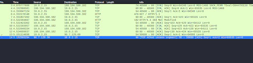
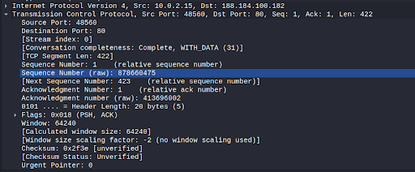
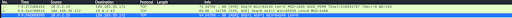
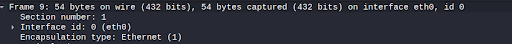
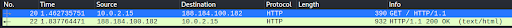
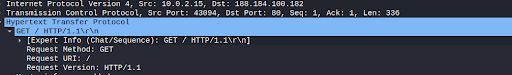
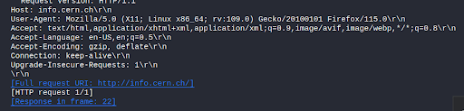
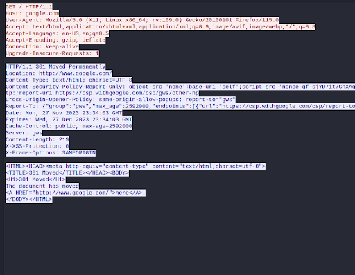

## **Lab: Network Traffic Analysis with Wireshark**

### **Overview**

The Kali Linux distribution includes a plethora of offensive security software tools that you will find useful in this course. Wielded by pentesters, ethical hackers, forensics investigators, and enthusiasts, Kali Linux is the popular go-to weapon for performing all manner of cyber attacks. Today you will use one of its most (in)famous tools: Wireshark.

Wireshark is capable of network traffic analysis, and is generally regarded as a computer forensics tool for its ability to “zoom in” and scrutinize network traffic at the lowest level.

### **Scenario**

GlobeX is currently contracted with a MSSP (Managed Security Service Provider), Secutronix, to perform a security evaluation of the various IT systems you’ve recently implemented. As part of the security evaluation, the MSSP has requested a sample of network traffic of a computer on the LAN viewing the [CERN website](http://info.cern.ch/). “Terrible timing! Our network analyst is out of the office this week,” the MSSP rep, Sarah, explains. “If you could fill out the audit form for us this one time, that would keep everyone’s timelines in track. Sorry to ask this of you!”

### **Objectives**

* Using Wireshark on Kali Linux, create a PCAP file consisting of an HTTP GET request to the CERN website.
* In Wireshark, filter your view to only HTTP traffic from Kali to this site.
* Perform an analysis of both the TCP and HTTP traffic.
* Export the capture as a PCAP file.

### **Resources**

* [Wireshark](https://www.wireshark.org/)
* [Wireshark Cheat Sheet](https://www.comparitech.com/net-admin/wireshark-cheat-sheet/)
* [Kali Linux](https://www.kali.org/downloads/)
* [Netgate Forums for pfSense Discussion & Support](https://forum.netgate.com/)

### **Tasks**

#### **Part 1: Deploy Kali Linux**

For this lab, all you’ll need on the VirtualBox LAN is Kali Linux deployed behind the pfSense firewall.

* Using the installer ISO file, deploy Kali Linux.
* Verify internet connectivity on Kali Linux.

#### **Part 2: Traffic Capture**

Perform a live capture of your ethernet device.

1. Launch Wireshark as root.
2. Select the network adapter that is displayed, note this may have different labels.
    1. You may see **<code>Eth0</code></strong>, <strong><code>Ensp03</code></strong>, <strong><code>Eth1</code></strong> etc.
    2. Don’t worry about the name of the adapter as different versions of virtualization software will name the adapter differently.
3. On the same computer, browse to the target website and perform an HTTP GET request.
4. Halt the capture. Take am moment to review the packets that were captured.
5. What is the difference between the various colors of packets that you see?
    3. Different Protocols

#### <strong>Part 3: TCP Analysis</strong>

Analyze the TCP segments. Answer the following questions:

1. How many segments are used here? 
    1. 10

2. What is the length in bytes of each segment? (Remember: The segment length is the size of the data contained in the packet)
    2. 422

3. Can you identify all three packets involved in the TCP three-way handshake? Include a screencap of them.

    3. SYN
    4. SYN, ACK, 
    5. ACK
4. How much data is typically acknowledged per ACK?
    6. 54 Bytes

#### **Part 4: HTTP Analysis**

1. Filter traffic to HTTP from source Kali Linux to destination CERN. Include a screenshot of the filtered view.

2. Locate the GET method that precedes a series of HTTP headers.

3. Look for the following common HTTP headers and include them if in your response if you can find them:
    1. Host
    2. User-Agent
    3. Accept, Accept-Encoding, Accept-Charset, Accept-Language
    4. Cookie
    5. Cache-Control

There were no Cookies or Cache-Control from the CERN Website

For instance, here is google which has both cookies and cache-control:

#### **Part 5: Wrapup**

When you are finished, save a PCAP file of the network traffic capture for future reference.

Search your favorite job site, such as [Indeed](https://www.indeed.com/), for the keyword “wireshark.”

1. What did you find?

A few jobs, quite a few in fact!

2. Why is network traffic analysis a relevant skill to have?

Network Traffic Analysis provides a proactive identification of issues, supports incident response, and enhances the overall resilience of data infrastructure.

3. Do you see yourself working in this type of job in the future?

Perhaps, I would need to gain more experience to understand if I am a good fit for a position as a network traffic analyzer. Personally, I find AI more interesting at the moment.
