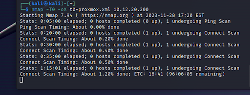
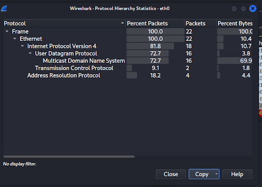

# Lab: Configuring and Monitoring Ports and Protocols

## **Lab: Configuring and Monitoring Ports and Protocols**

### **Overview**

The network mapping tool Nmap is an open source, command line utility commonly used in network discovery (“enumeration” in offensive terms), security auditing, and pentesting. Nmap can audit whether ports are open or closed on a target host.

Today you will perform basic scanning operations in Nmap. You’ll also be configuring your DNS server to change the destination of a given domain.

### **Resources**

* [Nmap Manual](https://nmap.org/book/man.html)
* [Nmap Cheat Sheet](https://www.comparitech.com/net-admin/nmap-nessus-cheat-sheet/)
    * [Nmap Cheat Sheet PDF](https://cdn.comparitech.com/wp-content/uploads/2019/06/Nmap-Cheat-Sheet.pdf)

### **Requirements**

#### **Part 1: Preparing a Network Environment and Staging Kali Linux**

**IMPORTANT: Restrict the scope of your scans to hosts that are on your own network or targets that you have permission to scan.**

First, prepare a suitable network environment by placing 2-3 different hosts together, either on the the same Host-only network with a pfSense router, or on the same NAT Network (without a pfSense router.

* Ideally, choose VMs with different OSs and/or different configurations (such as a Windows 10 host, an Ubuntu Server, and a pfSense router).
* These will be your targets today.

Use the Kali Linux Virtual Machine you built on Lab 01, and place it on the same network.

Kali Linux comes bundled with Nmap already installed, and can be accessed by using the **<code>nmap</code></strong> command in Kali’s terminal.

#### **Part 2: Port Scanning with Nmap**

Let’s get some practice using Nmap by performing a series of scans (described below).

For each scan:

1. Output the results of the command into a file.

2. Include in your lab write-up:
    1. A screenshot of the output of the command.
        1. Hint: Use the **<code>cat</code></strong> command to print the contents of a file to the terminal, or open the file in Kali’s built-in text editor.
    2. The exact command you used.
        2. Nmap -v -sn -oX scan.txt 10.12.20.1
3. Answer the following questions:
    3. What does this scan do in technical terms?
        3. In technical terms, this scan is a ping scan designed to identify live hosts in the specified network (10.12.20.1).
    4. Was the scan correct?
        4. Yes
    5. Why/why not?
        5. This is my pfsense, I verified the IP address prior to pinging it. So I knew it was valid and currently “UP”
    6. Why would you perform this particular scan?
        6. This is an advanced version of ping. If I was having success with pings, but still not able to connect to a host, using this command and a few others would help figure out why.

On the local network shared by Kali and your target VMs:

1. Perform a scan to discover all hosts on , without scanning any ports.

    1. In this case, I just did a scan nmap -v -sn -oX scan1.txt 10.12.20.1/23 (Seemed like the easiest way)
    2. I saved my results.
2. Perform a fast, aggressive scan of the network.

3. Scan the 1000 most common ports on each host on the network.
    3. First Host (pfsense) 10.12.20.1

    4. Second Host (Windows) 10.12.21.40

    5. Third Host (proxmox) 10.12.20.200

    6. Fourth Host (Kali) 10.12.21.228

4. Perform an intense scan on all hosts on the network.
    7. First Host (pfsense) 10.12.20.1

    8. Second Host (Windows) 10.12.21.40

    9. Third Host (proxmox) 10.12.20.200

    10. Fourth Host (Kali) 10.12.21.228

5. Perform a slow, comprehensive scan on all hosts on the network.
    11. First Host (pfsense) 10.12.20.1

    12. Second Host (Windows) 10.12.21.40

    13. Third Host (proxmox) 10.12.20.200

    14. Fourth Host (Kali) 10.12.21.228

**My VM crashed, this is as far as I got. As you can see, they were all expected to finish at 11PM, I was going to let them run, but that failed.**

_If your local target is yielding inadequate results, try changing your Kali VM’s network settings to Bridged and use **<code>nmap</code></strong> to target <strong><code>scanme.nmap.org</code></strong>, which is a test host provided by Nmap for this very purpose.</em>

#### **Part 3: Reporting Nmap Findings**

Compile your Nmap findings in an organized fashion.

1. Create a **Scans Performed** table with three columns: **<code>Scan Type</code></strong>, <strong><code>Scan Results</code></strong>, <strong><code>Actual</code></strong>.
    1. Populate the table with your results.

<table>
  <tr>
   <td>
   </td>
   <td>
Scan Type
   </td>
   <td>Scan Results
   </td>
  </tr>
  <tr>
   <td>10.12.20.1 pfsense
   </td>
   <td>T4
   </td>
   <td>Ports: 53/open/tcp//domain///, 80/open/tcp//http///, 443/open/tcp//https///     \
Ignored State: filtered (997)
   </td>
  </tr>
  <tr>
   <td>10.12.20.200 proxmox
   </td>
   <td>T4
   </td>
   <td>Ports: 22/open/tcp//ssh///, 111/open/tcp//rpcbind///, 3128/open/tcp//squid-http///      Ignored State: closed (997)
   </td>
  </tr>
  <tr>
   <td>10.12.21.40 windows
   </td>
   <td>T4
   </td>
   <td>Ports: 139/open/tcp//netbios-ssn///, 445/open/tcp//microsoft-ds///, 8008/open/tcp//http///, 8009/open/tcp//ajp13///, 8443/open/tcp//https-alt///, 9000/open/tcp//cslistener///, 10001/open/tcp//scp-config///  \
Ignored State: closed (993)
   </td>
  </tr>
  <tr>
   <td>10.12.21.228 Kali
   </td>
   <td>T4
   </td>
   <td>Ignored State: closed (1000)
   </td>
  </tr>
  <tr>
   <td>10.12.20.1 pfsense
   </td>
   <td>T2
   </td>
   <td>53/tcp  open  domain, 80/tcp  open  http, 443/tcp open  https
   </td>
  </tr>
  <tr>
   <td>10.12.20.200 proxmox
   </td>
   <td>T2
   </td>
   <td>22/tcp open ssh, 111/tcp open rpcbind, 3128/tcp open squid-http
   </td>
  </tr>
  <tr>
   <td>10.12.21.40 windows
   </td>
   <td>T2
   </td>
   <td>139/tcp   open  netbios-ssn, 445/tcp   open  microsoft-ds, 8008/tcp  open  http, 8009/tcp  open  ajp13, 8443/tcp  open  https-alt, 9000/tcp  open  cslistener, 10001/tcp open  scp-config
   </td>
  </tr>
  <tr>
   <td>10.12.21.228 Kali
   </td>
   <td>T2
   </td>
   <td>All 1000 scanned ports on 10.12.21.228 are in ignored states.
   </td>
  </tr>
  <tr>
   <td>10.12.20.1 pfsense
   </td>
   <td>T1
   </td>
   <td><strong>SEE PART 2</strong>
   </td>
  </tr>
  <tr>
   <td>10.12.20.200 proxmox
   </td>
   <td>T1
   </td>
   <td><strong>SEE PART 2</strong>
   </td>
  </tr>
  <tr>
   <td>10.12.21.40 windows
   </td>
   <td>T1
   </td>
   <td><strong>SEE PART 2</strong>
   </td>
  </tr>
  <tr>
   <td>10.12.21.228 Kali
   </td>
   <td>T1
   </td>
   <td><strong>SEE PART 2</strong>
   </td>
  </tr>
  <tr>
   <td>Entire Network
   </td>
   <td>-sn
   </td>
   <td>Nmap scan report for pfSense.mylocal (10.12.20.1)

Host is up (0.00021s latency).

MAC Address: 60:BE:B4:04:53:E1 (S-Bluetech, limited)

Nmap scan report for 10.12.20.200

Host is up (0.00028s latency).

MAC Address: 7C:83:34:BD:57:85 (Shenzhen AZW Technology)

Nmap scan report for 10.12.21.40

Host is up (0.00059s latency).

MAC Address: 48:B0:2D:64:D7:84 (Nvidia)

Nmap scan report for 10.12.21.120

Host is up (0.00023s latency).

MAC Address: 3C:7C:3F:1D:E8:81 (ASUSTek Computer)

Nmap scan report for 10.12.21.228

Host is up.
   </td>
  </tr>
  <tr>
   <td>pfsense
   </td>
   <td>sT
   </td>
   <td>PORT    STATE SERVICE

53/tcp  open  domain

80/tcp  open  http

443/tcp open  https
   </td>
  </tr>
  <tr>
   <td>proxmox
   </td>
   <td>sT
   </td>
   <td>PORT     STATE SERVICE

22/tcp   open  ssh

111/tcp  open  rpcbind

3128/tcp open  squid-http
   </td>
  </tr>
  <tr>
   <td>windows
   </td>
   <td>sT
   </td>
   <td>PORT      STATE SERVICE

139/tcp   open  netbios-ssn

445/tcp   open  microsoft-ds

8008/tcp  open  http

8009/tcp  open  ajp13

8443/tcp  open  https-alt

9000/tcp  open  cslistener

10001/tcp open  scp-config
   </td>
  </tr>
  <tr>
   <td>kali
   </td>
   <td>sT
   </td>
   <td>Not shown: 1000 closed tcp ports (conn-refused)
   </td>
  </tr>
</table>

2. Create a **Service Enumeration** table with three columns: **<code>Server IP Address</code></strong>, <strong><code>Ports Open</code></strong>, and <strong><code>Service/Banner</code></strong>.
    2. Populate the table with your results.
    3. Indicate above the table your network range with CIDR block notation.

<table>
  <tr>
   <td>
Server IP Address (10.12.20.0/23)
   </td>
   <td>Ports Open
   </td>
   <td>Service/Banner
   </td>
  </tr>
  <tr>
   <td>10.12.20.1
   </td>
   <td>53

80

443
   </td>
   <td>Domain

Http

https
   </td>
  </tr>
  <tr>
   <td>10.12.20.200
   </td>
   <td>22

111

3128
   </td>
   <td>ssh

rpcbind

squid-http
   </td>
  </tr>
  <tr>
   <td>10.12.21.40
   </td>
   <td>139

445

8008

8009

8443

9000

10001
   </td>
   <td>Netbios

Microsoft-ds

Http

Ajp13

Https-alt

Cslistener

scp-config
   </td>
  </tr>
  <tr>
   <td>10.12.21.228
   </td>
   <td>None
   </td>
   <td>None
   </td>
  </tr>
</table>

**_FOR EXAMPLE:_**

_Network Range: 192.168.1.0/24 | Server IP Address | Ports Open | Service/Banner | _

_| 192.168.1.1 | 52 | domain | | | 80 | http | | _

_192.168.1.11 | 22 | ssh | | | 25 | smtp |_

#### **Part 4: Protocol Hierarchy Statistics with Wireshark**

Let’s explore some protocol-related capabilities of Wireshark in Kali Linux.

1. In Wireshark, generate a Protocol Hierarchy Statistics report. Include a screenshot.

"Protocol","Percent Packets","Packets","Percent Bytes","Bytes","Bits/s","End Packets","End Bytes","End Bits/s","PDUs"

"Frame",100,22,100,3353,2525.1367431623885,0,0,0,22

"Ethernet",100,22,10.438413361169102,350,263.5842111860531,0,0,0,22

"Internet Protocol Version 4",81.81818181818181,18,10.736653742916792,360,271.1151886485117,0,0,0,18

"User Datagram Protocol",72.72727272727273,16,3.8174768863704145,128,96.39651151947083,0,0,0,16

"Multicast Domain Name System",72.72727272727273,16,69.87772144348345,2343,1764.508019454064,16,2343,1764.508019454064,16

"Transmission Control Protocol",9.090909090909092,2,1.7894422904861318,60,45.185864774751956,2,60,45.185864774751956,2

"Address Resolution Protocol",18.181818181818183,4,4.413957649865792,148,111.45846644438816,4,148,111.45846644438816,4

2. Which hosts are the top talkers and listeners on this link? Check the **<code>Statistics > Endpoints</code></strong> menu.
    1. The biggest talkers (transmitters) (one of my Windows PCs that just came on)

3. The biggest listeners (recievers) I have no idea yet who 224.0.0.251 is, but he MUST be stopped, the second highest is my VM

4. Select Close and then select **<code>Statistics > Conversations</code></strong>. Sort this by session duration and include a screenshot.

#### **Part 5: Netstat**

**<code>Netstat</code></strong> can reveal port and service information on a Windows host. Include screenshots (or copied text) of your entered command and the output for the following on a Windows VM:

1. From a terminal prompt, run a **<code>netstat</code></strong> command that shows all active ports.

┌──(kali㉿kali)-[~]

└─$ netstat -a

Active Internet connections (servers and established)

Proto Recv-Q Send-Q Local Address           Foreign Address         State      

udp        0      0 10.12.21.228:bootpc     pfSense.mylocal:bootps  ESTABLISHED

udp6       0      0 fe80::83e:dhcpv6-client [::]:*                             

raw        0      0 0.0.0.0:255             0.0.0.0:*               7          

raw        0      0 0.0.0.0:255             0.0.0.0:*               7          

raw6       0      0 [::]:ipv6-icmp          [::]:*                  7          

Active UNIX domain sockets (servers and established)

Proto RefCnt Flags       Type       State         I-Node   Path

unix  3      [ ]         STREAM     CONNECTED     19369    /run/systemd/journal/stdout

unix  3      [ ]         STREAM     CONNECTED     158308   @/tmp/.X11-unix/X0

unix  3      [ ]         STREAM     CONNECTED     20942    

unix  3      [ ]         STREAM     CONNECTED     19086    

unix  3      [ ]         STREAM     CONNECTED     155457   /run/user/1000/bus

unix  3      [ ]         STREAM     CONNECTED     140754   /run/systemd/journal/stdout

unix  3      [ ]         STREAM     CONNECTED     31412    

unix  3      [ ]         STREAM     CONNECTED     20531    @/tmp/.X11-unix/X0

unix  3      [ ]         STREAM     CONNECTED     20005    

unix  3      [ ]         STREAM     CONNECTED     19805    

unix  3      [ ]         STREAM     CONNECTED     20166    @/tmp/.X11-unix/X0

unix  3      [ ]         STREAM     CONNECTED     20097    /run/dbus/system_bus_socket

unix  3      [ ]         STREAM     CONNECTED     19198    /run/dbus/system_bus_socket

unix  3      [ ]         STREAM     CONNECTED     71618    

unix  3      [ ]         STREAM     CONNECTED     19433    @/tmp/.X11-unix/X0

unix  3      [ ]         STREAM     CONNECTED     20040    

unix  3      [ ]         STREAM     CONNECTED     20586    @/tmp/.X11-unix/X0

unix  3      [ ]         STREAM     CONNECTED     19856    

unix  3      [ ]         STREAM     CONNECTED     19480    

unix  3      [ ]         STREAM     CONNECTED     20174    

unix  3      [ ]         STREAM     CONNECTED     20665    /run/user/1000/bus

unix  3      [ ]         STREAM     CONNECTED     19914    @/tmp/.X11-unix/X0

unix  2      [ ACC ]     STREAM     LISTENING     18472    /tmp/.X11-unix/X0

unix  3      [ ]         STREAM     CONNECTED     20508    

unix  3      [ ]         STREAM     CONNECTED     20846    /run/user/1000/bus

unix  3      [ ]         STREAM     CONNECTED     19973    

unix  3      [ ]         STREAM     CONNECTED     19270    /run/user/1000/bus

unix  3      [ ]         DGRAM      CONNECTED     18195    

unix  3      [ ]         STREAM     CONNECTED     16235    

unix  3      [ ]         STREAM     CONNECTED     17360    

unix  3      [ ]         STREAM     CONNECTED     157226   /run/user/1000/at-spi/bus_0

unix  3      [ ]         STREAM     CONNECTED     80111    /run/systemd/journal/stdout

unix  3      [ ]         STREAM     CONNECTED     19894    @/tmp/.X11-unix/X0

unix  2      [ ACC ]     STREAM     LISTENING     19638    /tmp/ssh-qpVVXNrj3H9o/agent.896

unix  3      [ ]         STREAM     CONNECTED     80084    

unix  3      [ ]         STREAM     CONNECTED     19365    

unix  3      [ ]         STREAM     CONNECTED     20734    /run/dbus/system_bus_socket

unix  3      [ ]         STREAM     CONNECTED     16175    

unix  3      [ ]         STREAM     CONNECTED     120055   

unix  3      [ ]         STREAM     CONNECTED     20537    /run/user/1000/pipewire-0

unix  3      [ ]         STREAM     CONNECTED     154503   @/tmp/.X11-unix/X0

unix  3      [ ]         STREAM     CONNECTED     140757   

unix  3      [ ]         STREAM     CONNECTED     19468    

unix  3      [ ]         STREAM     CONNECTED     19353    /run/systemd/journal/stdout

unix  2      [ ACC ]     STREAM     LISTENING     19322    /tmp/.ICE-unix/896

unix  3      [ ]         STREAM     CONNECTED     18997    /run/systemd/journal/stdout

unix  3      [ ]         STREAM     CONNECTED     20020    

unix  2      [ ]         DGRAM      CONNECTED     19652    

unix  3      [ ]         STREAM     CONNECTED     20974    

unix  3      [ ]         STREAM     CONNECTED     19443    @/tmp/.X11-unix/X0

unix  3      [ ]         STREAM     CONNECTED     19702    

unix  3      [ ]         STREAM     CONNECTED     20523    

unix  3      [ ]         STREAM     CONNECTED     20512    /run/user/1000/pulse/native

unix  3      [ ]         STREAM     CONNECTED     71624    @/tmp/.ICE-unix/896

unix  3      [ ]         STREAM     CONNECTED     21002    @/tmp/.X11-unix/X0

unix  3      [ ]         STREAM     CONNECTED     20624    

unix  3      [ ]         STREAM     CONNECTED     19507    

unix  2      [ ]         DGRAM                    20060    

unix  3      [ ]         STREAM     CONNECTED     20841    

unix  3      [ ]         STREAM     CONNECTED     20583    @/tmp/.X11-unix/X0

unix  3      [ ]         STREAM     CONNECTED     19269    

unix  3      [ ]         STREAM     CONNECTED     158315   

unix  3      [ ]         STREAM     CONNECTED     79261    @/tmp/.X11-unix/X0

unix  3      [ ]         STREAM     CONNECTED     78814    

unix  3      [ ]         DGRAM      CONNECTED     15739    

unix  3      [ ]         STREAM     CONNECTED     158314   

unix  3      [ ]         STREAM     CONNECTED     31413    /run/user/1000/at-spi/bus_0

unix  3      [ ]         STREAM     CONNECTED     158313   @/tmp/.ICE-unix/896

unix  3      [ ]         STREAM     CONNECTED     154508   

unix  3      [ ]         STREAM     CONNECTED     19056    /run/systemd/journal/stdout

unix  3      [ ]         STREAM     CONNECTED     20938    /run/systemd/journal/stdout

unix  3      [ ]         STREAM     CONNECTED     19806    @/tmp/.X11-unix/X0

unix  3      [ ]         STREAM     CONNECTED     16161    

unix  3      [ ]         STREAM     CONNECTED     32125    

unix  3      [ ]         STREAM     CONNECTED     19703    /run/user/1000/bus

unix  3      [ ]         STREAM     CONNECTED     79241    

unix  3      [ ]         STREAM     CONNECTED     19440    /run/user/1000/bus

unix  3      [ ]         STREAM     CONNECTED     19666    

unix  2      [ ]         DGRAM      CONNECTED     18277    

unix  3      [ ]         STREAM     CONNECTED     19813    

unix  3      [ ]         STREAM     CONNECTED     20007    /run/user/1000/bus

unix  3      [ ]         STREAM     CONNECTED     20502    /run/user/1000/at-spi/bus_0

unix  3      [ ]         STREAM     CONNECTED     32123    @/tmp/.X11-unix/X0

unix  3      [ ]         STREAM     CONNECTED     20056    

unix  3      [ ]         STREAM     CONNECTED     20571    /run/dbus/system_bus_socket

unix  3      [ ]         STREAM     CONNECTED     19913    

unix  3      [ ]         STREAM     CONNECTED     19873    

unix  3      [ ]         STREAM     CONNECTED     17570    /run/systemd/journal/stdout

unix  3      [ ]         STREAM     CONNECTED     19981    /run/systemd/journal/stdout

unix  3      [ ]         STREAM     CONNECTED     19494    /run/user/1000/bus

unix  3      [ ]         STREAM     CONNECTED     20481    

unix  3      [ ]         STREAM     CONNECTED     80122    /run/user/1000/bus

unix  3      [ ]         STREAM     CONNECTED     19075    

unix  3      [ ]         STREAM     CONNECTED     20903    

unix  3      [ ]         STREAM     CONNECTED     72530    @/tmp/.X11-unix/X0

unix  3      [ ]         STREAM     CONNECTED     20886    

unix  3      [ ]         STREAM     CONNECTED     19225    

unix  3      [ ]         STREAM     CONNECTED     154506   

unix  3      [ ]         STREAM     CONNECTED     158094   /run/user/1000/bus

unix  3      [ ]         STREAM     CONNECTED     140749   

unix  3      [ ]         STREAM     CONNECTED     19928    

unix  3      [ ]         STREAM     CONNECTED     19658    /run/user/1000/bus

unix  3      [ ]         STREAM     CONNECTED     18425    

unix  3      [ ]         STREAM     CONNECTED     79232    /run/user/1000/bus

unix  3      [ ]         STREAM     CONNECTED     20042    /run/dbus/system_bus_socket

unix  3      [ ]         STREAM     CONNECTED     19757    /run/user/1000/bus

unix  3      [ ]         STREAM     CONNECTED     115429   /run/user/1000/at-spi/bus_0

unix  3      [ ]         STREAM     CONNECTED     19836    

unix  3      [ ]         STREAM     CONNECTED     19701    @/tmp/.X11-unix/X0

unix  3      [ ]         STREAM     CONNECTED     20009    /run/dbus/system_bus_socket

unix  3      [ ]         STREAM     CONNECTED     19800    @/tmp/.X11-unix/X0

unix  3      [ ]         STREAM     CONNECTED     18950    /run/dbus/system_bus_socket

unix  2      [ ]         DGRAM      CONNECTED     20961    

unix  3      [ ]         STREAM     CONNECTED     17433    /run/systemd/journal/stdout

unix  3      [ ]         STREAM     CONNECTED     20507    

unix  2      [ ]         DGRAM      CONNECTED     17725    

unix  3      [ ]         STREAM     CONNECTED     20171    

unix  3      [ ]         STREAM     CONNECTED     20525    

unix  3      [ ]         STREAM     CONNECTED     18474    

unix  3      [ ]         STREAM     CONNECTED     20937    

unix  3      [ ]         STREAM     CONNECTED     20041    

unix  3      [ ]         STREAM     CONNECTED     19924    

unix  3      [ ]         STREAM     CONNECTED     19850    

unix  3      [ ]         STREAM     CONNECTED     115426   

unix  3      [ ]         STREAM     CONNECTED     80129    /run/user/1000/pipewire-0

unix  3      [ ]         STREAM     CONNECTED     20527    /run/user/1000/bus

unix  3      [ ]         STREAM     CONNECTED     19506    

unix  3      [ ]         DGRAM      CONNECTED     2000     

unix  3      [ ]         STREAM     CONNECTED     15762    /run/systemd/journal/stdout

unix  3      [ ]         STREAM     CONNECTED     20842    /run/user/1000/at-spi/bus_0

unix  3      [ ]         STREAM     CONNECTED     19974    

unix  3      [ ]         STREAM     CONNECTED     19816    

unix  2      [ ]         DGRAM                    18358    /run/user/1000/systemd/notify

unix  3      [ ]         STREAM     CONNECTED     17542    /run/dbus/system_bus_socket

unix  3      [ ]         STREAM     CONNECTED     20870    /run/systemd/journal/stdout

unix  2      [ ACC ]     STREAM     LISTENING     18361    /run/user/1000/systemd/private

unix  3      [ ]         STREAM     CONNECTED     20957    /run/systemd/journal/stdout

unix  2      [ ACC ]     STREAM     LISTENING     18370    /run/user/1000/bus

unix  3      [ ]         STREAM     CONNECTED     115430   

unix  3      [ ]         STREAM     CONNECTED     71626    

unix  3      [ ]         STREAM     CONNECTED     19438    @/tmp/.ICE-unix/896

unix  3      [ ]         DGRAM      CONNECTED     15054    /run/systemd/notify

unix  2      [ ACC ]     STREAM     LISTENING     15057    /run/systemd/private

unix  3      [ ]         STREAM     CONNECTED     71622    

unix  3      [ ]         STREAM     CONNECTED     19383    

unix  2      [ ACC ]     STREAM     LISTENING     18371    /run/user/1000/gnupg/S.dirmngr

unix  3      [ ]         STREAM     CONNECTED     16127    /run/systemd/journal/stdout

unix  3      [ ]         STREAM     CONNECTED     80123    /run/dbus/system_bus_socket

unix  3      [ ]         STREAM     CONNECTED     19931    

unix  2      [ ]         DGRAM                    18951    

unix  2      [ ACC ]     STREAM     LISTENING     15059    /run/systemd/userdb/io.systemd.DynamicUser

unix  3      [ ]         STREAM     CONNECTED     154509   

unix  3      [ ]         STREAM     CONNECTED     140755   /run/systemd/journal/stdout

unix  3      [ ]         STREAM     CONNECTED     19305    

unix  3      [ ]         STREAM     CONNECTED     19055    /run/systemd/journal/stdout

unix  2      [ ACC ]     STREAM     LISTENING     18373    /run/user/1000/gcr/ssh

unix  2      [ ACC ]     STREAM     LISTENING     15060    /run/systemd/io.system.ManagedOOM

unix  3      [ ]         STREAM     CONNECTED     74393    @/tmp/.X11-unix/X0

unix  3      [ ]         STREAM     CONNECTED     20897    

unix  3      [ ]         STREAM     CONNECTED     20605    /run/dbus/system_bus_socket

unix  3      [ ]         STREAM     CONNECTED     19408    

unix  2      [ ACC ]     STREAM     LISTENING     18375    /run/user/1000/keyring/control

unix  3      [ ]         STREAM     CONNECTED     1986     

unix  3      [ ]         STREAM     CONNECTED     115989   @/tmp/.X11-unix/X0

unix  2      [ ACC ]     STREAM     LISTENING     18377    /run/user/1000/gnupg/S.gpg-agent.browser

unix  2      [ ACC ]     STREAM     LISTENING     1804     /run/systemd/fsck.progress

unix  3      [ ]         STREAM     CONNECTED     80120    /run/user/1000/at-spi/bus_0

unix  3      [ ]         STREAM     CONNECTED     80078    

unix  3      [ ]         STREAM     CONNECTED     20578    @/tmp/.X11-unix/X0

unix  2      [ ACC ]     STREAM     LISTENING     18379    /run/user/1000/gnupg/S.gpg-agent.extra

unix  3      [ ]         STREAM     CONNECTED     20640    

unix  3      [ ]         STREAM     CONNECTED     20522    /run/user/1000/at-spi/bus_0

unix  3      [ ]         STREAM     CONNECTED     19881    

unix  2      [ ACC ]     STREAM     LISTENING     18381    /run/user/1000/gnupg/S.gpg-agent.ssh

unix  3      [ ]         STREAM     CONNECTED     157221   

unix  3      [ ]         STREAM     CONNECTED     72534    

unix  3      [ ]         STREAM     CONNECTED     20680    /run/user/1000/bus

unix  3      [ ]         STREAM     CONNECTED     19885    @/tmp/.X11-unix/X0

unix  2      [ ACC ]     STREAM     LISTENING     18383    /run/user/1000/gnupg/S.gpg-agent

unix  13     [ ]         DGRAM      CONNECTED     1805     /run/systemd/journal/dev-log

unix  3      [ ]         STREAM     CONNECTED     20509    /run/user/1000/at-spi/bus_0

unix  6      [ ]         DGRAM      CONNECTED     1807     /run/systemd/journal/socket

unix  2      [ ACC ]     STREAM     LISTENING     18385    /run/user/1000/pulse/native

unix  2      [ ACC ]     STREAM     LISTENING     1809     /run/systemd/journal/stdout

unix  3      [ ]         STREAM     CONNECTED     20633    /run/user/1000/at-spi/bus_0

unix  3      [ ]         STREAM     CONNECTED     19431    @/tmp/.ICE-unix/896

unix  2      [ ACC ]     STREAM     LISTENING     18387    /run/user/1000/pipewire-0

unix  2      [ ACC ]     SEQPACKET  LISTENING     1811     /run/udev/control

unix  3      [ ]         STREAM     CONNECTED     73448    

unix  3      [ ]         STREAM     CONNECTED     21004    

unix  3      [ ]         STREAM     CONNECTED     19847    @/tmp/.ICE-unix/896

unix  3      [ ]         DGRAM      CONNECTED     18359    

unix  3      [ ]         STREAM     CONNECTED     20675    

unix  3      [ ]         STREAM     CONNECTED     80085    /run/systemd/journal/stdout

unix  3      [ ]         STREAM     CONNECTED     19752    /run/user/1000/bus

unix  3      [ ]         STREAM     CONNECTED     157004   

unix  2      [ ]         DGRAM      CONNECTED     16164    

unix  3      [ ]         STREAM     CONNECTED     158312   

unix  3      [ ]         STREAM     CONNECTED     155456   @/tmp/.ICE-unix/896

unix  3      [ ]         STREAM     CONNECTED     32126    /run/user/1000/bus

unix  3      [ ]         STREAM     CONNECTED     72532    @/tmp/.X11-unix/X0

unix  3      [ ]         STREAM     CONNECTED     20892    

unix  2      [ ]         DGRAM                    17799    

unix  3      [ ]         STREAM     CONNECTED     19972    

unix  3      [ ]         STREAM     CONNECTED     19648    @/tmp/.X11-unix/X0

unix  3      [ ]         STREAM     CONNECTED     19447    /run/user/1000/at-spi/bus_0

unix  3      [ ]         STREAM     CONNECTED     78815    /run/user/1000/gvfsd/socket-GmGh8SCm

unix  2      [ ACC ]     STREAM     LISTENING     19502    /run/user/1000/keyring/pkcs11

unix  3      [ ]         STREAM     CONNECTED     80068    

unix  3      [ ]         STREAM     CONNECTED     20826    @/tmp/.X11-unix/X0

unix  3      [ ]         STREAM     CONNECTED     20645    @/tmp/.ICE-unix/896

unix  3      [ ]         STREAM     CONNECTED     20599    

unix  3      [ ]         STREAM     CONNECTED     19891    /run/user/1000/at-spi/bus_0

unix  3      [ ]         STREAM     CONNECTED     19860    @/tmp/.X11-unix/X0

unix  3      [ ]         STREAM     CONNECTED     17565    

unix  3      [ ]         STREAM     CONNECTED     19488    

unix  3      [ ]         STREAM     CONNECTED     20498    

unix  3      [ ]         STREAM     CONNECTED     74398    @/tmp/.ICE-unix/896

unix  3      [ ]         STREAM     CONNECTED     19837    

unix  3      [ ]         STREAM     CONNECTED     20971    

unix  3      [ ]         STREAM     CONNECTED     20117    

unix  2      [ ACC ]     STREAM     LISTENING     19302    /run/user/1000/at-spi/bus_0

unix  3      [ ]         STREAM     CONNECTED     19510    

unix  3      [ ]         STREAM     CONNECTED     20091    

unix  3      [ ]         STREAM     CONNECTED     19799    

unix  3      [ ]         STREAM     CONNECTED     19048    /run/dbus/system_bus_socket

unix  3      [ ]         STREAM     CONNECTED     121675   

unix  3      [ ]         STREAM     CONNECTED     80125    /run/dbus/system_bus_socket

unix  3      [ ]         STREAM     CONNECTED     18421    

unix  2      [ ACC ]     STREAM     LISTENING     1860     /run/systemd/journal/io.systemd.journal

unix  3      [ ]         STREAM     CONNECTED     19936    /run/dbus/system_bus_socket

unix  3      [ ]         STREAM     CONNECTED     19307    

unix  3      [ ]         STREAM     CONNECTED     19104    /run/dbus/system_bus_socket

unix  3      [ ]         STREAM     CONNECTED     20703    

unix  3      [ ]         STREAM     CONNECTED     16188    /run/dbus/system_bus_socket

unix  3      [ ]         STREAM     CONNECTED     19453    /run/user/1000/bus

unix  3      [ ]         STREAM     CONNECTED     18011    @/tmp/.X11-unix/X0

unix  2      [ ]         DGRAM      CONNECTED     15733    

unix  3      [ ]         STREAM     CONNECTED     20073    /run/dbus/system_bus_socket

unix  3      [ ]         STREAM     CONNECTED     19279    /run/systemd/journal/stdout

unix  3      [ ]         STREAM     CONNECTED     17539    

unix  3      [ ]         STREAM     CONNECTED     20608    /run/user/1000/bus

unix  2      [ ]         DGRAM      CONNECTED     1863     

unix  3      [ ]         STREAM     CONNECTED     73445    

unix  3      [ ]         STREAM     CONNECTED     20529    

unix  3      [ ]         STREAM     CONNECTED     19920    /run/systemd/journal/stdout

unix  3      [ ]         STREAM     CONNECTED     20489    /run/user/1000/at-spi/bus_0

unix  3      [ ]         STREAM     CONNECTED     19175    /run/user/1000/pipewire-0

unix  3      [ ]         STREAM     CONNECTED     20098    

unix  3      [ ]         STREAM     CONNECTED     115993   /run/user/1000/at-spi/bus_0

unix  3      [ ]         STREAM     CONNECTED     20173    @/tmp/.ICE-unix/896

unix  3      [ ]         STREAM     CONNECTED     19845    

unix  3      [ ]         DGRAM      CONNECTED     15055    

unix  3      [ ]         STREAM     CONNECTED     20871    /run/user/1000/bus

unix  3      [ ]         STREAM     CONNECTED     19404    /run/user/1000/at-spi/bus_0

unix  2      [ ]         DGRAM                    19512    

unix  3      [ ]         STREAM     CONNECTED     19941    @/tmp/.ICE-unix/896

unix  3      [ ]         STREAM     CONNECTED     18700    

unix  2      [ ]         DGRAM      CONNECTED     121674   

unix  3      [ ]         STREAM     CONNECTED     19828    

unix  2      [ ]         DGRAM      CONNECTED     120045   

unix  3      [ ]         STREAM     CONNECTED     80079    /run/systemd/journal/stdout

unix  3      [ ]         STREAM     CONNECTED     20943    /run/user/1000/bus

unix  3      [ ]         STREAM     CONNECTED     16187    

unix  3      [ ]         STREAM     CONNECTED     80116    

unix  3      [ ]         STREAM     CONNECTED     20485    

unix  3      [ ]         STREAM     CONNECTED     19076    /run/systemd/journal/stdout

unix  2      [ ]         DGRAM      CONNECTED     17374    

unix  3      [ ]         STREAM     CONNECTED     20904    /run/systemd/journal/stdout

unix  3      [ ]         STREAM     CONNECTED     20876    

unix  3      [ ]         STREAM     CONNECTED     19248    @/tmp/.X11-unix/X0

unix  3      [ ]         STREAM     CONNECTED     15973    

unix  3      [ ]         STREAM     CONNECTED     20504    /run/user/1000/bus

unix  3      [ ]         STREAM     CONNECTED     20914    /run/user/1000/bus

unix  3      [ ]         STREAM     CONNECTED     20607    

unix  3      [ ]         STREAM     CONNECTED     21005    /run/user/1000/bus

unix  3      [ ]         STREAM     CONNECTED     20913    

unix  3      [ ]         STREAM     CONNECTED     19902    

unix  3      [ ]         STREAM     CONNECTED     19875    

unix  3      [ ]         STREAM     CONNECTED     19498    

unix  3      [ ]         STREAM     CONNECTED     17575    /run/dbus/system_bus_socket

unix  3      [ ]         STREAM     CONNECTED     20172    /run/user/1000/at-spi/bus_0

unix  3      [ ]         STREAM     CONNECTED     20070    

unix  3      [ ]         STREAM     CONNECTED     19882    

unix  3      [ ]         STREAM     CONNECTED     18475    /run/dbus/system_bus_socket

unix  3      [ ]         STREAM     CONNECTED     19995    /run/dbus/system_bus_socket

unix  3      [ ]         STREAM     CONNECTED     20570    

unix  3      [ ]         STREAM     CONNECTED     19097    /run/dbus/system_bus_socket

unix  3      [ ]         STREAM     CONNECTED     20499    /run/user/1000/bus

unix  3      [ ]         STREAM     CONNECTED     19970    

unix  3      [ ]         STREAM     CONNECTED     19627    @/tmp/.X11-unix/X0

unix  3      [ ]         STREAM     CONNECTED     15702    /run/systemd/journal/stdout

unix  3      [ ]         STREAM     CONNECTED     20765    

unix  3      [ ]         STREAM     CONNECTED     19452    

unix  3      [ ]         STREAM     CONNECTED     19081    /run/systemd/journal/stdout

unix  3      [ ]         DGRAM      CONNECTED     15738    

unix  3      [ ]         STREAM     CONNECTED     19366    /run/user/1000/at-spi/bus_0

unix  3      [ ]         STREAM     CONNECTED     20722    

unix  3      [ ]         STREAM     CONNECTED     19109    

unix  3      [ ]         STREAM     CONNECTED     157223   /run/user/1000/at-spi/bus_0

unix  3      [ ]         STREAM     CONNECTED     154511   

unix  3      [ ]         STREAM     CONNECTED     20496    

unix  3      [ ]         STREAM     CONNECTED     19074    /run/systemd/journal/stdout

unix  2      [ ]         DGRAM      CONNECTED     15492    

unix  3      [ ]         STREAM     CONNECTED     20008    

unix  3      [ ]         STREAM     CONNECTED     18282    

unix  3      [ ]         STREAM     CONNECTED     19399    @/tmp/.ICE-unix/896

unix  3      [ ]         STREAM     CONNECTED     21007    /run/user/1000/at-spi/bus_0

unix  3      [ ]         STREAM     CONNECTED     19308    /run/user/1000/bus

unix  3      [ ]         STREAM     CONNECTED     19087    /run/dbus/system_bus_socket

unix  3      [ ]         STREAM     CONNECTED     21001    

unix  3      [ ]         STREAM     CONNECTED     20490    /run/user/1000/bus

unix  3      [ ]         STREAM     CONNECTED     20898    /run/user/1000/bus

unix  3      [ ]         STREAM     CONNECTED     20642    @/tmp/.X11-unix/X0

unix  3      [ ]         STREAM     CONNECTED     19903    @/tmp/.X11-unix/X0

unix  3      [ ]         STREAM     CONNECTED     17574    

unix  3      [ ]         STREAM     CONNECTED     74395    @/tmp/.X11-unix/X0

unix  3      [ ]         STREAM     CONNECTED     20524    /run/user/1000/bus

unix  3      [ ]         STREAM     CONNECTED     19859    

unix  3      [ ]         STREAM     CONNECTED     19495    

unix  3      [ ]         STREAM     CONNECTED     19900    /run/user/1000/at-spi/bus_0

unix  3      [ ]         STREAM     CONNECTED     17734    

unix  3      [ ]         STREAM     CONNECTED     20733    

unix  3      [ ]         STREAM     CONNECTED     19603    @/tmp/.X11-unix/X0

unix  3      [ ]         STREAM     CONNECTED     115424   

unix  2      [ ACC ]     STREAM     LISTENING     17350    /run/dbus/system_bus_socket

unix  3      [ ]         STREAM     CONNECTED     80110    

unix  3      [ ]         STREAM     CONNECTED     19446    

unix  2      [ ACC ]     STREAM     LISTENING     17351    /run/pcscd/pcscd.comm

unix  3      [ ]         STREAM     CONNECTED     20054    /run/systemd/journal/stdout

unix  3      [ ]         STREAM     CONNECTED     19779    /run/user/1000/bus

unix  3      [ ]         STREAM     CONNECTED     154510   

unix  3      [ ]         STREAM     CONNECTED     19073    /run/systemd/journal/stdout

unix  3      [ ]         STREAM     CONNECTED     157224   

unix  3      [ ]         STREAM     CONNECTED     19935    

unix  3      [ ]         STREAM     CONNECTED     18701    /run/systemd/journal/stdout

unix  3      [ ]         STREAM     CONNECTED     19407    /run/dbus/system_bus_socket

unix  3      [ ]         STREAM     CONNECTED     20095    

unix  3      [ ]         STREAM     CONNECTED     21006    

unix  3      [ ]         STREAM     CONNECTED     19513    

unix  2      [ ]         DGRAM      CONNECTED     18319    

unix  3      [ ]         STREAM     CONNECTED     80089    /run/user/1000/bus

unix  3      [ ]         STREAM     CONNECTED     74400    /run/user/1000/at-spi/bus_0

unix  3      [ ]         STREAM     CONNECTED     19834    

unix  2      [ ]         DGRAM      CONNECTED     17510    

unix  3      [ ]         STREAM     CONNECTED     20501    

unix  3      [ ]         STREAM     CONNECTED     158310   @/tmp/.X11-unix/X0

unix  3      [ ]         STREAM     CONNECTED     20079    

unix  3      [ ]         STREAM     CONNECTED     20664    

unix  3      [ ]         STREAM     CONNECTED     19479    

unix  3      [ ]         STREAM     CONNECTED     74399    

unix  3      [ ]         STREAM     CONNECTED     20491    /run/user/1000/bus

unix  3      [ ]         STREAM     CONNECTED     19456    /run/user/1000/at-spi/bus_0

unix  3      [ ]         STREAM     CONNECTED     115987   @/tmp/.X11-unix/X0

unix  3      [ ]         STREAM     CONNECTED     19857    @/tmp/.X11-unix/X0

unix  3      [ ]         STREAM     CONNECTED     20887    /run/user/1000/bus

unix  3      [ ]         DGRAM      CONNECTED     18194    

unix  3      [ ]         STREAM     CONNECTED     17361    /run/systemd/journal/stdout

unix  3      [ ]         STREAM     CONNECTED     20594    @/tmp/.X11-unix/X0

unix  3      [ ]         STREAM     CONNECTED     19278    

unix  3      [ ]         STREAM     CONNECTED     17419    /run/systemd/journal/stdout

unix  3      [ ]         STREAM     CONNECTED     121676   

unix  3      [ ]         STREAM     CONNECTED     19665    /run/user/1000/at-spi/bus_0

unix  3      [ ]         STREAM     CONNECTED     115992   

unix  3      [ ]         STREAM     CONNECTED     79265    

unix  3      [ ]         STREAM     CONNECTED     31414    @/tmp/.ICE-unix/896

unix  3      [ ]         STREAM     CONNECTED     16122    

unix  3      [ ]         STREAM     CONNECTED     19368    

unix  3      [ ]         STREAM     CONNECTED     20923    /run/user/1000/bus

unix  3      [ ]         STREAM     CONNECTED     19846    

unix  3      [ ]         STREAM     CONNECTED     19511    /run/user/1000/bus

unix  3      [ ]         STREAM     CONNECTED     115432   

unix  3      [ ]         STREAM     CONNECTED     20956    

unix  3      [ ]         STREAM     CONNECTED     20096    

unix  3      [ ]         STREAM     CONNECTED     19803    

unix  3      [ ]         STREAM     CONNECTED     20497    

unix  2      [ ]         DGRAM      CONNECTED     17577    

unix  3      [ ]         STREAM     CONNECTED     73447    

unix  3      [ ]         STREAM     CONNECTED     20926    /run/user/1000/gvfsd/socket-FUHpY185

unix  3      [ ]         STREAM     CONNECTED     20677    /run/user/1000/at-spi/bus_0

unix  3      [ ]         STREAM     CONNECTED     20585    

unix  3      [ ]         STREAM     CONNECTED     19451    /run/user/1000/at-spi/bus_0

unix  3      [ ]         STREAM     CONNECTED     19496    /run/user/1000/pipewire-0

unix  3      [ ]         STREAM     CONNECTED     80069    /run/systemd/journal/stdout

unix  3      [ ]         STREAM     CONNECTED     19884    

unix  3      [ ]         STREAM     CONNECTED     19897    @/tmp/.X11-unix/X0

unix  3      [ ]         STREAM     CONNECTED     80119    

unix  3      [ ]         STREAM     CONNECTED     19174    /run/user/1000/pipewire-0

unix  3      [ ]         STREAM     CONNECTED     20763    

unix  3      [ ]         STREAM     CONNECTED     20601    /run/user/1000/bus

unix  3      [ ]         STREAM     CONNECTED     19247    

unix  3      [ ]         STREAM     CONNECTED     16236    /run/systemd/journal/stdout

unix  3      [ ]         STREAM     CONNECTED     157005   

unix  3      [ ]         STREAM     CONNECTED     19418    

unix  3      [ ]         STREAM     CONNECTED     19926    

unix  3      [ ]         STREAM     CONNECTED     32127    

unix  3      [ ]         STREAM     CONNECTED     19373    

unix  3      [ ]         STREAM     CONNECTED     157219   

unix  2      [ ]         DGRAM                    110354   

unix  3      [ ]         STREAM     CONNECTED     20676    /run/user/1000/at-spi/bus_0

unix  3      [ ]         STREAM     CONNECTED     73450    

unix  3      [ ]         STREAM     CONNECTED     19700    

unix  2      [ ]         DGRAM      CONNECTED     18329    

unix  3      [ ]         STREAM     CONNECTED     20975    /run/dbus/system_bus_socket

unix  3      [ ]         STREAM     CONNECTED     19842    

unix  3      [ ]         STREAM     CONNECTED     19804    @/tmp/.X11-unix/X0

unix  3      [ ]         STREAM     CONNECTED     17538    

unix  3      [ ]         STREAM     CONNECTED     20012    

unix  3      [ ]         STREAM     CONNECTED     20764    /run/user/1000/bus

unix  3      [ ]         STREAM     CONNECTED     19984    

unix  3      [ ]         STREAM     CONNECTED     19821    /run/systemd/journal/stdout

unix  3      [ ]         STREAM     CONNECTED     15761    

unix  3      [ ]         STREAM     CONNECTED     18010    

unix  3      [ ]         STREAM     CONNECTED     19870    @/tmp/.X11-unix/X0

unix  3      [ ]         STREAM     CONNECTED     19080    

unix  3      [ ]         STREAM     CONNECTED     79228    /run/user/1000/bus

unix  3      [ ]         STREAM     CONNECTED     20925    

unix  3      [ ]         STREAM     CONNECTED     20530    /run/user/1000/bus

unix  3      [ ]         STREAM     CONNECTED     19916    

unix  3      [ ]         STREAM     CONNECTED     19493    

unix  3      [ ]         STREAM     CONNECTED     31408    

unix  3      [ ]         STREAM     CONNECTED     20088    /run/user/1000/bus

unix  3      [ ]         STREAM     CONNECTED     19876    @/tmp/.X11-unix/X0

unix  3      [ ]         STREAM     CONNECTED     20510    

unix  3      [ ]         STREAM     CONNECTED     19812    

unix  3      [ ]         STREAM     CONNECTED     20016    /run/systemd/journal/stdout

unix  3      [ ]         STREAM     CONNECTED     72536    /run/user/1000/at-spi/bus_0

unix  3      [ ]         STREAM     CONNECTED     79240    

unix  3      [ ]         STREAM     CONNECTED     19690    

unix  3      [ ]         STREAM     CONNECTED     19103    

unix  3      [ ]         DGRAM      CONNECTED     18360    

unix  3      [ ]         STREAM     CONNECTED     31416    /run/user/1000/at-spi/bus_0

unix  3      [ ]         STREAM     CONNECTED     71625    

unix  3      [ ]         STREAM     CONNECTED     19363    

unix  3      [ ]         STREAM     CONNECTED     16178    /run/dbus/system_bus_socket

unix  3      [ ]         STREAM     CONNECTED     140750   

unix  3      [ ]         STREAM     CONNECTED     19940    

unix  3      [ ]         STREAM     CONNECTED     19419    /run/dbus/system_bus_socket

unix  3      [ ]         STREAM     CONNECTED     19469    

unix  3      [ ]         STREAM     CONNECTED     120054   

unix  3      [ ]         STREAM     CONNECTED     20845    

unix  3      [ ]         STREAM     CONNECTED     20589    @/tmp/.X11-unix/X0

unix  3      [ ]         STREAM     CONNECTED     19252    

unix  3      [ ]         STREAM     CONNECTED     71620    

unix  3      [ ]         STREAM     CONNECTED     17555    /run/dbus/system_bus_socket

unix  3      [ ]         STREAM     CONNECTED     19865    /run/user/1000/bus

unix  3      [ ]         STREAM     CONNECTED     80121    

unix  3      [ ]         STREAM     CONNECTED     20169    

unix  3      [ ]         STREAM     CONNECTED     20071    /run/dbus/system_bus_socket

unix  3      [ ]         STREAM     CONNECTED     20486    /run/dbus/system_bus_socket

unix  3      [ ]         STREAM     CONNECTED     19476    /run/user/1000/bus

unix  3      [ ]         STREAM     CONNECTED     32121    @/tmp/.X11-unix/X0

unix  3      [ ]         STREAM     CONNECTED     20628    

unix  3      [ ]         STREAM     CONNECTED     20526    /run/user/1000/at-spi/bus_0

unix  3      [ ]         STREAM     CONNECTED     19892    

unix  3      [ ]         STREAM     CONNECTED     20503    

unix  3      [ ]         STREAM     CONNECTED     17430    

unix  3      [ ]         STREAM     CONNECTED     20006    

unix  3      [ ]         STREAM     CONNECTED     19437    /run/user/1000/bus

unix  3      [ ]         STREAM     CONNECTED     115991   @/tmp/.ICE-unix/896

unix  3      [ ]         STREAM     CONNECTED     74397    /run/user/1000/at-spi/bus_0

unix  3      [ ]         STREAM     CONNECTED     19367    

unix  3      [ ]         STREAM     CONNECTED     71623    /run/user/1000/at-spi/bus_0

unix  3      [ ]         STREAM     CONNECTED     19110    /run/user/1000/bus

unix  3      [ ]         STREAM     CONNECTED     31415    

unix  3      [ ]         STREAM     CONNECTED     20533    /run/user/1000/at-spi/bus_0

unix  3      [ ]         STREAM     CONNECTED     158091   /run/dbus/system_bus_socket

unix  3      [ ]         STREAM     CONNECTED     155453   @/tmp/.X11-unix/X0

unix  3      [ ]         STREAM     CONNECTED     18410    

unix  3      [ ]         STREAM     CONNECTED     80128    

unix  3      [ ]         STREAM     CONNECTED     20494    

unix  3      [ ]         DGRAM      CONNECTED     2001     

unix  3      [ ]         STREAM     CONNECTED     74392    

unix  3      [ ]         STREAM     CONNECTED     20877    /run/systemd/journal/stdout

unix  3      [ ]         STREAM     CONNECTED     20620    @/tmp/.X11-unix/X0

unix  3      [ ]         STREAM     CONNECTED     19283    

unix  3      [ ]         STREAM     CONNECTED     19908    @/tmp/.X11-unix/X0

unix  3      [ ]         STREAM     CONNECTED     73449    /run/user/1000/bus

unix  3      [ ]         STREAM     CONNECTED     20087    

unix  3      [ ]         STREAM     CONNECTED     20614    

unix  3      [ ]         STREAM     CONNECTED     19890    

unix  3      [ ]         STREAM     CONNECTED     20521    

unix  3      [ ]         STREAM     CONNECTED     19851    @/tmp/.X11-unix/X0

unix  3      [ ]         STREAM     CONNECTED     19111    /run/user/1000/bus

unix  3      [ ]         STREAM     CONNECTED     20972    /run/user/1000/bus

unix  3      [ ]         STREAM     CONNECTED     20116    

unix  3      [ ]         STREAM     CONNECTED     19835    /run/user/1000/at-spi/bus_0

unix  3      [ ]         STREAM     CONNECTED     19735    

unix  3      [ ]         STREAM     CONNECTED     115431   /run/user/1000/bus

unix  3      [ ]         STREAM     CONNECTED     157225   /run/user/1000/bus

unix  3      [ ]         STREAM     CONNECTED     155458   /run/user/1000/at-spi/bus_0

unix  3      [ ]         STREAM     CONNECTED     79263    

unix  3      [ ]         STREAM     CONNECTED     19127    /run/dbus/system_bus_socket

unix  2      [ ]         DGRAM                    16174    

unix  3      [ ]         STREAM     CONNECTED     19748    @/tmp/.X11-unix/X0

unix  3      [ ]         STREAM     CONNECTED     80083    

unix  3      [ ]         STREAM     CONNECTED     20681    

unix  3      [ ]         STREAM     CONNECTED     19454    

unix  3      [ ]         STREAM     CONNECTED     19267    

unix  3      [ ]         STREAM     CONNECTED     20893    /run/systemd/journal/stdout

unix  3      [ ]         STREAM     CONNECTED     19969    

unix  3      [ ]         STREAM     CONNECTED     17735    /run/dbus/system_bus_socket

unix  2      [ ]         DGRAM                    20623    

unix  3      [ ]         STREAM     CONNECTED     20511    /run/user/1000/bus

unix  3      [ ]         STREAM     CONNECTED     80077    

unix  3      [ ]         STREAM     CONNECTED     31410    

unix  3      [ ]         STREAM     CONNECTED     20057    /run/systemd/journal/stdout

unix  3      [ ]         STREAM     CONNECTED     19099    /run/dbus/system_bus_socket

unix  3      [ ]         STREAM     CONNECTED     20600    /run/user/1000/at-spi/bus_0

unix  3      [ ]         STREAM     CONNECTED     19919    

unix  3      [ ]         STREAM     CONNECTED     19864    

unix  3      [ ]         STREAM     CONNECTED     115428   

unix  3      [ ]         STREAM     CONNECTED     79236    

unix  3      [ ]         STREAM     CONNECTED     72535    /run/user/1000/bus

unix  3      [ ]         STREAM     CONNECTED     19832    

unix  3      [ ]         STREAM     CONNECTED     19691    /run/user/1000/at-spi/bus_0

unix  3      [ ]         DGRAM      CONNECTED     15056    

unix  3      [ ]         STREAM     CONNECTED     20021    /run/user/1000/bus

unix  3      [ ]         STREAM     CONNECTED     19405    /run/user/1000/bus

unix  3      [ ]         STREAM     CONNECTED     18305    

unix  3      [ ]         STREAM     CONNECTED     155452   

unix  3      [ ]         STREAM     CONNECTED     140758   /run/user/1000/bus

unix  3      [ ]         STREAM     CONNECTED     19304    

unix  3      [ ]         STREAM     CONNECTED     155455   /run/user/1000/at-spi/bus_0

unix  3      [ ]         STREAM     CONNECTED     19968    

unix  3      [ ]         STREAM     CONNECTED     18403    

unix  3      [ ]         STREAM     CONNECTED     19402    

unix  3      [ ]         STREAM     CONNECTED     17716    /run/dbus/system_bus_socket

unix  3      [ ]         STREAM     CONNECTED     20724    /run/dbus/system_bus_socket

unix  2      [ ACC ]     STREAM     LISTENING     18471    @/tmp/.X11-unix/X0

unix  2      [ ACC ]     STREAM     LISTENING     19321    @/tmp/.ICE-unix/896

unix  3      [ ]         STREAM     CONNECTED     19473    @c7adf7ec9a4d1980/bus/systemd/bus-api-user

unix  3      [ ]         STREAM     CONNECTED     17523    @bd9baf3c48ecd1f9/bus/systemd-logind/system

unix  3      [ ]         STREAM     CONNECTED     17543    @8449bff89fb56fd5/bus/systemd/bus-api-system

unix  3      [ ]         STREAM     CONNECTED     18362    @47500a8d488d92a4/bus/systemd/bus-system

2. Run a **<code>netstat</code></strong> command that displays the routing table.

Kernel IP routing table

Destination     Gateway         Genmask         Flags   MSS Window  irtt Iface

default         pfSense.mylocal 0.0.0.0         UG        0 0          0 eth0

10.12.20.0      0.0.0.0         255.255.254.0   U         0 0          0 eth0

3. Run a **<code>netstat</code></strong> command that only displays connections for the TCP protocol.

Helpful sources:

[https://www.oreilly.com/library/view/nmap-6-network/9781849517485/ch08s03.html](https://www.oreilly.com/library/view/nmap-6-network/9781849517485/ch08s03.html)

[https://nullsec.us/top-1-000-tcp-and-udp-ports-nmap-default/](https://nullsec.us/top-1-000-tcp-and-udp-ports-nmap-default/)

[https://chat.openai.com/c/21d8ee83-f7b4-45be-bb50-2779ec959d60](https://chat.openai.com/c/21d8ee83-f7b4-45be-bb50-2779ec959d60)
