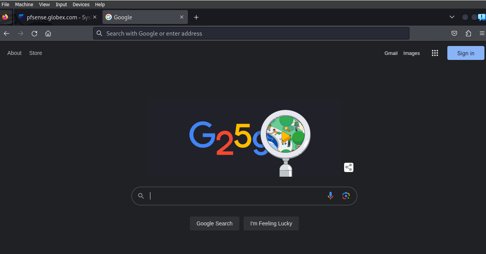

# **Lab: Domain Controller**

## **Overview**

During deployment of Windows Server one of the first steps is to assign
it the correct roles and be promote it to DC (Domain Controller). Once
promoted, the DC can not only facilitate centralized identity management
with AD (Active Directory), but can also allow the systems administrator
to "push" standardized configurations to Windows endpoints using GPOs
(Group Policy Objects). Growing companies and enterprises alike will
utilize these Windows Server features in order to more effectively
administer endpoints at scale.

## **Scenario**

The GlobeX CEO has requested that endpoint configuration be centrally
administered along with other critical services. "I've got sales reps
losing customer data to random Windows updates!" he fumes. "This is
unacceptable; how does anyone get any work done with these kinds of
interruptions? I'm really hoping you can get our computers configured to
some kind of standard."

As part of your project to transition GlobeX from Workgroup to Domain,
the next step is to configure the new Windows Server so that it can
perform these critical roles on the GlobeX network.

## **Objectives**

-   Add the following roles to your Windows Server:

    -   DC

    -   AD

    -   DNS

-   Create a DNS entry in the forward lookup zone that changes how a
    > domain name resolves.

-   Promote this server to a Domain Controller (DC).

-   Add a new forest and create a local domain,
    > **corp.globexpower.com**, with a NetBIOS of **CORP**.

-   Install BgInfo on the Windows Server.

-   Update your network topology diagram with any changes made to your
    > network.

## **Resources**

-   [Microsoft Documentation - Install or Uninstall Roles, Role
    > Services, or
    > Features](https://docs.microsoft.com/en-us/windows-server/administration/server-manager/install-or-uninstall-roles-role-services-or-features)

-   [How to create a Windows Domain and
    > AD](https://www.informaticar.net/server-basics-06-how-to-create-windows-domain-active-directory/)

## **Tasks**

### **Part 1: DNS**

In order for AD and DC to function properly, we'll need to configure
Windows Server to act as the DNS server for this LAN instead of pfSense.
Ideally, pfSense should be configured to be aware that Windows Server's
IP address is the DNS of this network.

-   ~~First, activate the DNS role on Windows Server using Server
    > Manager.~~

{width="8.239583333333334in"
height="5.916666666666667in"}

{width="8.5in"
height="3.2083333333333335in"}

-   ~~Next, you'll need to point your network hosts to it as their DNS
    > server. Configure pfSense to assign the DNS server for LAN hosts
    > to use this Windows Server's IP address if possible; otherwise,
    > you can manually assign DNS server IP via the Windows
    > Server/Windows 10 network adapter settings.~~

{width="11.979166666666666in"
height="7.572916666666667in"}

-   ~~Verify that all devices have working DNS through Windows Server
    > and can browse the internet.~~

{width="6.427083333333333in"
height="3.8229166666666665in"}

**Kali and Windows Server 2019 Are connected!**

{width="7.265625546806649in"
height="3.7975459317585303in"}

-   ~~Test your DNS is working by applying a forward lookup zone. Create
    > a new forward lookup that causes http://admin.globexpower.com to
    > resolve as the IP address of pfSense.~~

**While messing around, I started getting DNS_Rebinding risk errors, so
I disabled them.**

{width="12.770833333333334in"
height="1.375in"}

{width="9.720793963254593in"
height="7.629905949256343in"}

### **Part 2: Active Directory**

Activate AD DS role on Windows Server.

-   ~~Install server roles:~~

    -   ~~Active Directory Domain Services.~~

{width="5.109375546806649in"
height="5.018997156605424in"}

-   ~~Promote this server to a Domain Controller.~~

{width="9.0625in"
height="0.875in"}

-   ~~Add a new forest. It's OK if your forest only has one tree.~~

    -   ~~Create a local domain using **corp.globexpower.com** as the
        > root domain name.~~

-   ~~Set a DSRM password.~~

-   ~~Set the NetBIOS name to **CORP**.~~

{width="10.583333333333334in"
height="3.2395833333333335in"}

**Completed setup as required!**

### **Part 3: BgInfo**

Next, let's set up a software tool that reveals useful information about
the computer.

-   ~~On Windows Server VM, download and install
    > [BgInfo](https://docs.microsoft.com/en-us/sysinternals/downloads/bginfo)
    > from Microsoft Sysinternals.~~

{width="6.885416666666667in"
height="1.9479166666666667in"}

-   ~~Run BgInfo and configure it to your liking.~~

{width="5.697916666666667in"
height="4.875in"}

-   ~~Set BgInfo to automatically run on login.~~

{width="8.197916666666666in"
height="5.770833333333333in"}

-   ~~Include a screenshot of your desktop in today's submission and
    > mention how you got it to auto-run.~~

{width="13.364583333333334in"
height="7.708333333333333in"}

*Consider deploying BgInfo to all your Windows VMs; it can save you time
by posting all that valuable system information up front instead of
hiding it behind menus or terminal commands.*

### **Part 4: Topology**

Update your network topology diagram with any changes made to your
network.

{width="10.46875in"
height="9.28125in"}
